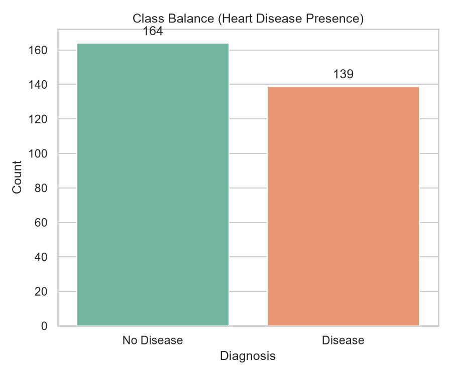
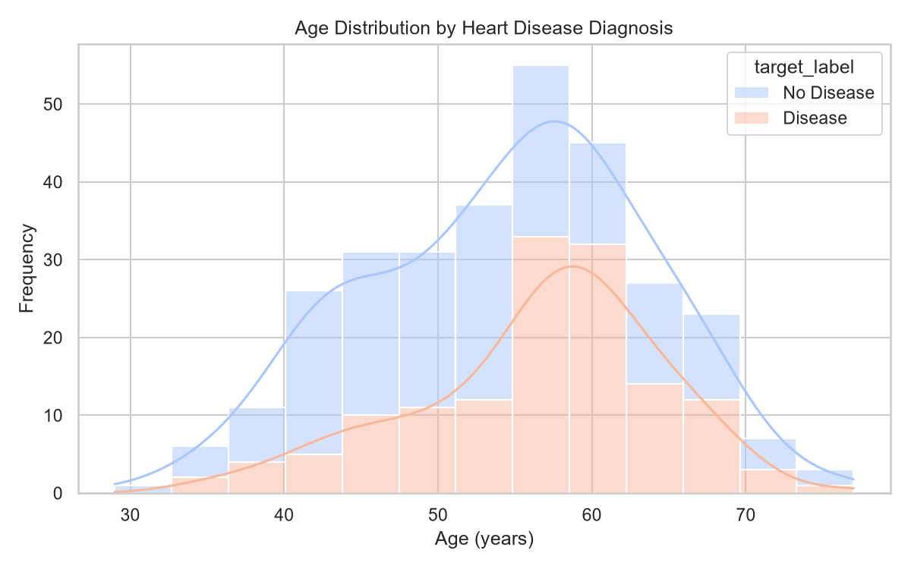
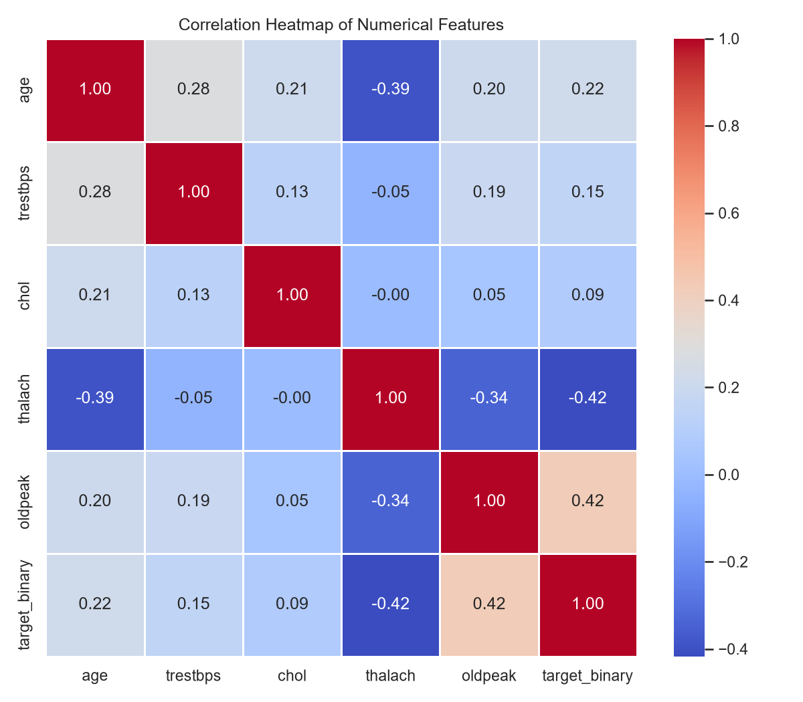
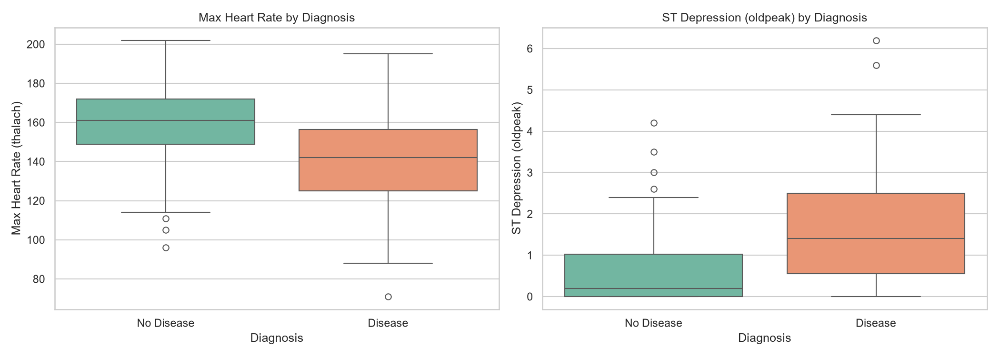

# Heart Disease Risk Prediction — MLOps Assignment 01

**Author:** V Gupta (2024AC05229)  
**Course:** Machine Learning Operations (MLOps) AIMLCZG523  

---

## Table of Contents
1. [Project Overview](#1-project-overview)
2. [Setup / Install Instructions](#2-setup--install-instructions)
3. [Data Acquisition & EDA](#3-data-acquisition--eda)
4. [Feature Engineering & Model Development](#4-feature-engineering--model-development)
5. [Experiment Tracking (MLflow)](#5-experiment-tracking-mlflow)
6. [Model Packaging & Reproducibility](#6-model-packaging--reproducibility)
7. [CI/CD Pipeline & Automated Testing](#7-cicd-pipeline--automated-testing)
8. [Model Containerization & Kubernetes Deployment](#8-model-containerization--kubernetes-deployment)
9. [Monitoring & Logging](#9-monitoring--logging)
10. [Architecture](#10-architecture)
11. [Conclusion](#11-conclusion)

---

## 1. Project Overview

This project implements an end-to-end Machine Learning Operations (MLOps) lifecycle solution to predict heart disease risk using the UCI Heart Disease (Cleveland) dataset. The classifier predicts whether a patient has heart disease (binary classification) based on 13 clinical variables.

The solution addresses the full MLOps lifecycle:
*   **Data Acquisition**: Scripted data ingestion, cleaning, and stratified train-test splitting.
*   **EDA**: Visualizations of class balance, age distributions, correlations, and key feature boxplots.
*   **Model Development**: Automated preprocessing and training pipelines using Logistic Regression and Random Forest with hyperparameter grid search cross-validation.
*   **Experiment Tracking**: Logging parameters, metrics, plots, and models to a local MLflow tracking store.
*   **Testing & CI/CD**: Automatic code linting (`flake8`), preprocessing verification, and API validation via `pytest` run inside a multi-stage GitHub Actions runner.
*   **Containerization & Deployment**: Packaging the API and model using Docker, deploying locally using Kubernetes (Minikube) manifests, and routing traffic via a LoadBalancer.
*   **System Monitoring**: Metrics collection (prediction confidence distributions, latencies, API request volumes) exposed via a Prometheus endpoint and configured for dashboard reporting.

*   **Repository Link:** [https://github.com/2024ac05229/Mlops](https://github.com/2024ac05229/Mlops)
*   **Deployed API:** Local Kubernetes cluster (Minikube) — mapped to port `80`.
*   **Video Recording Link:** [MLOps Demo Presentation](https://drive.google.com/file/d/1GXonxL_9Aj16MX2n2EhdOVv5D6ueTr1-/view?usp=sharing) (Placeholder)

---

## 2. Setup / Install Instructions

The system runs in a Python virtual environment and has no manual code-execution steps. 

### Prerequisites
*   Python 3.10+
*   Docker & Kubernetes (Minikube)

### Local Environment Setup
```bash
# Clone the repository and navigate to the project directory
git clone https://github.com/2024ac05229/Mlops.git
cd Mlops

# Create and activate Python virtual environment
python -m venv .venv
# Windows:
.venv\Scripts\activate
# Linux/macOS:
source .venv/bin/activate

# Install all required dependencies
pip install -r requirements.txt
```

### Execution Flow
```bash
# 1. Ingest, preprocess and split dataset
python data/download_dataset.py

# 2. Generate EDA visualizations
python notebooks/eda.py

# 3. Train models and track runs via MLflow
python src/train.py

# 4. Execute unit and integration tests
python -m pytest tests/

# 5. Build and run Docker container locally
docker build -t heart-disease-api:latest .
docker run -d -p 8000:8000 --name heart-disease-api-instance heart-disease-api:latest
```

---

## 3. Data Acquisition & EDA

### Dataset Description
The dataset contains **303 patient records** containing 13 clinical features (such as age, sex, chest pain type, resting blood pressure, cholesterol, ECG results, max heart rate, and ST depression) and a target label representing presence/absence of heart disease (originally multi-class, collapsed to binary).

### Data Ingestion and Cleansing
In [download_dataset.py](file:///c:/Project/mlops/data/download_dataset.py), the script fetches raw data, identifies missing values (denoted as `?` in `ca` and `thal`), binarizes the target column, and saves stratified splits (`train.csv` with 242 rows and `test.csv` with 61 rows) under `data/processed/`.

### Class Balance
The dataset contains 164 records with no disease (54.1%) and 139 records showing presence (45.9%), making it reasonably balanced:



### Missing Value Analysis
Missing values are handled dynamically during preprocessing. The raw dataset contains 4 missing values in `ca` and 2 missing values in `thal`, both resolved during pipelines using mode imputation:



### Feature Correlation
Feature correlations are evaluated to analyze relationships with the target labels. Variable attributes like `thal`, `ca`, `exang`, and `oldpeak` display positive correlations with diagnosis, while `thalach` is negatively correlated:



### Key Feature Boxplots
Boxplots illustrate relationships between heart disease risk and max heart rate achieved (`thalach`) alongside ST depression (`oldpeak`):



---

## 4. Feature Engineering & Model Development

### Preprocessing Pipelines
To prevent data leakage, a modular scikit-learn `ColumnTransformer` is defined in [preprocessing.py](file:///c:/Project/mlops/src/preprocessing.py):
*   **Numerical Features (`age`, `trestbps`, `chol`, `thalach`, `oldpeak`)**: Imputed using median values, then standardized via `StandardScaler()`.
*   **Categorical Features (`sex`, `cp`, `fbs`, `restecg`, `exang`, `slope`, `ca`, `thal`)**: Imputed using the most frequent category, then encoded using `OneHotEncoder(handle_unknown="ignore", sparse_output=False)`.

The transformer is combined directly with classifiers into a single scikit-learn `Pipeline`, guaranteeing identical pre-processing operations during model fitting and API inference.

### Model Training & Tuning
In [train.py](file:///c:/Project/mlops/src/train.py), two classifiers (**Logistic Regression** and **Random Forest**) are trained and tuned using `GridSearchCV` (5-fold stratified cross-validation on ROC-AUC):
*   **Logistic Regression Parameters**: `C` $\in$ `[0.01, 0.1, 1.0, 10.0]`, `penalty` = `l2`, `solver` = `lbfgs`.
*   **Random Forest Parameters**: `n_estimators` $\in$ `[50, 100, 200]`, `max_depth` $\in$ `[None, 5, 10]`, `min_samples_split` $\in$ `[2, 5]`.

### Held-out Test Set Results
Comparing the tuned pipeline models on the 20% hold-out test split yields the following metrics:

| Model | CV ROC-AUC | Test Accuracy | Test Precision | Test Recall | Test F1-Score | Test ROC-AUC |
| :--- | :--- | :--- | :--- | :--- | :--- | :--- |
| **Logistic Regression** | **0.8982** | **88.52%** | **83.87%** | **92.86%** | **88.14%** | **0.9654** |
| **Random Forest** | 0.9043 | 85.25% | 82.76% | 85.71% | 84.21% | 0.9470 |

Based on these results, **Logistic Regression** is chosen as the champion model and serialized to [best_model.joblib](file:///c:/Project/mlops/models/best_model.joblib).

---

## 5. Experiment Tracking (MLflow)

All training experiments are logged to a local MLflow server. Every execution tracks:
*   **Parameters**: Hyperparameters searched (e.g. classifier regularization or trees depth).
*   **Metrics**: Intermediate cross-validation score and final test metrics (Accuracy, F1, ROC-AUC).
*   **Plots**: Confusion matrices and ROC curves generated during evaluation.
*   **Artifacts**: Serialized pipeline binary file (`model`).

Runs are grouped under the experiment `"Heart_Disease_Classifier_Experiment"`.

*   **View MLflow UI locally:**  
    ```bash
    mlflow ui --backend-store-uri sqlite:///mlflow.db
    ```
    Then visit `http://localhost:5000` in your web browser.

---

## 6. Model Packaging & Reproducibility

To ensure reproducibility across environments:
1.  **Serialized Pipelines**: Preprocessing rules and classifier weights are compiled into one `Pipeline` saved to [models/best_model.joblib](file:///c:/Project/mlops/models/best_model.joblib).
2.  **Dependency Versioning**: Exact package requirements are pinned in [requirements.txt](file:///c:/Project/mlops/requirements.txt).
3.  **Module Imports**: Directory layouts and `PYTHONPATH` setups ensure the model loads correctly in both local scripts and isolated Docker environments.

---

## 7. CI/CD Pipeline & Automated Testing

### Automated Tests
A suite of tests is defined under `tests/` using `pytest`:
*   [test_data.py](file:///c:/Project/mlops/tests/test_data.py): Verifies split dataset existence, column counts, target values, and preprocessing transformer pipelines.
*   [test_model.py](file:///c:/Project/mlops/tests/test_model.py): Spins up the API using `FastAPI.testclient` and validates server responses on `/health` and `/predict` (both success and error schemas).

### CI/CD Workflow
The GitHub Actions workflow is defined in [.github/workflows/ci-cd.yml](file:///c:/Project/mlops/.github/workflows/ci-cd.yml) (named **MLOPS pipeline**) and runs on three distinct stages linked by artifact passing:

1.  **`lint-and-download` (Lint and Download Dataset)**:
    *   Fails the build on code syntax or formatting errors using `flake8` (ignoring `.venv`).
    *   Downloads the Cleveland data, performs split, and uploads splits as an artifact (`processed-data`).
2.  **`train-model` (Train Model and Log to MLflow)**:
    *   Downloads the `processed-data` artifact.
    *   Executes `train.py` to retrain, log runs to MLflow, and upload the generated model binary (`trained-model`).
3.  **`test-model` (Run Unit and Server Tests)**:
    *   Downloads the dataset and model artifacts.
    *   Executes tests (`python -m pytest tests/`).

---

## 8. Model Containerization & Kubernetes Deployment

### Containerization (Docker)
The application is containerized using [Dockerfile](file:///c:/Project/mlops/Dockerfile), copying source structures and dependencies to a `python:3.10-slim` base image.
*   **Build command:** `docker build -t heart-disease-api:latest .`
*   **Run command:** `docker run -d -p 8000:8000 --name heart-disease-api-instance heart-disease-api:latest`

### Kubernetes Deployment
Manifests under `kubernetes/` define orchestration configurations:
*   [deployment.yaml](file:///c:/Project/mlops/kubernetes/deployment.yaml): Specifies a deployment (`heart-disease-api`) running 2 replicas. Configures resource requests/limits, environment variables, and liveness + readiness probes monitoring `/health`.
*   [service.yaml](file:///c:/Project/mlops/kubernetes/service.yaml): Configures a LoadBalancer service (`heart-disease-service`) that exposes API traffic from port `80` to container port `8000`.

---

## 9. Monitoring & Logging

System metrics are exposed directly from the API layer on `/metrics` using the Prometheus client, tracking:
*   **Traffic volume**: `api_requests_total` counter labeled by endpoint, method, and HTTP status.
*   **Latency**: `api_request_duration_seconds` histogram metrics tracking response times.
*   **Output distribution**: `api_predictions_total` tracking frequency of low-risk vs high-risk outputs.
*   **Output confidence**: `api_prediction_confidence` monitoring classifier certainty.

### Monitoring Stack
A monitoring orchestration template is defined in [docker-compose.monitoring.yml](file:///c:/Project/mlops/docker-compose.monitoring.yml) along with target metrics in [monitoring/prometheus.yml](file:///c:/Project/mlops/monitoring/prometheus.yml), which scrapes metric details from the FastAPI application and pushes them to a local Prometheus instance.

---

## 10. Architecture

The system flows through a standard end-to-end MLOps pipeline structure:

```
+--------------------+      +-------------------------+      +---------------------------+
|   UCI Repository   | ---> | data/download_dataset   | ---> |  data/processed (Splits)  |
+--------------------+      +-------------------------+      +---------------------------+
                                                                           |
                                                                           v
+--------------------+      +-------------------------+      +---------------------------+
|  MLflow Server DB  | <--- |      src/train.py       | <--- |   src/preprocessing.py    |
|  (sqlite tracking) |      |   (GridSearch Tuning)   |      |    (ColumnTransformer)    |
+--------------------+      +-------------------------+      +---------------------------+
                                         |
                                         v
                            +-------------------------+      +---------------------------+
                            |   models/best_model     | ---> |        api/main.py        |
                            |      (Serialized)       |      |     (FastAPI Server)      |
                            +-------------------------+      +---------------------------+
                                                                           |
                                                                           v
                                                             +---------------------------+
                                                             |   Docker / Kubernetes     |
                                                             |   (Prometheus Metrics)    |
                                                             +---------------------------+
```

---

## 11. Conclusion

This repository demonstrates a fully compliant production-ready MLOps classifier pipeline. Preprocessing pipelines ensure data consistency, grid search CV trains and verifies multiple model classes, and automated GitHub Actions jobs run tests before merging. The Docker and Kubernetes deployment manifests scale container pods, and Prometheus counters track model performance metrics.

**Possible Future Enhancements:**
1.  **Model Drift Identification**: Schedule cron jobs comparing incoming API payload features with baseline training matrices to identify model degradation.
2.  **Model Registry**: Register models directly into the MLflow model registry and control promotion workflows from staging to production dynamically.
3.  **Helm Chart Packaging**: Refactor Kubernetes raw manifests into a Helm chart for flexible environmental deployments.
